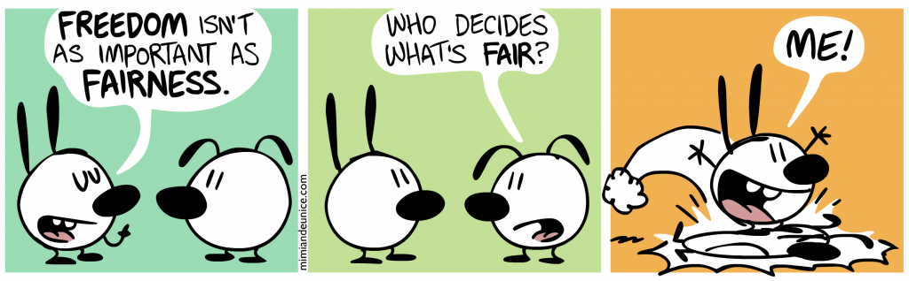

In the recent years, there has been a lot of attention on the need for ethical considerations in ML, as well as the different ways to address bias in different stages of the ML pipeline. However, there hasn't been a lot of focus on how to bring fairness to ML products.

Building fairness into any system (ML or otherwise) is hard. There are no universally agreed upon philosophies on what it means to be just or fair - is it equal opportunity, demographic parity or something else? How can you make sure that machine learning models in production are just and fair? And are the people in your company the right people to decide what’s fair? We'll start with two simple proposals that are both wrong, but teach us a lot in their wrongness.

First, what if business users were presented with fairness dial that they could turn up and down and evaluate against any other business metrics (e.g., revenue)? This approach would result in the consideration of  fairness and bias as a zero sum game, where some other key metric has to be sacrificed.
Alternatively, what if data scientists could ping an API to compute the scores for their models over ~30 definitions of fairness? The unintended consequence of this approach is that it creates a sense of “being fair” as long as one of them shows a good result. Metrics are only helpful if you understand what it really means when they move up and down.

It is difficult to build fairness into products when there are competing incentives such as optimizing for revenue or conversion. How do we build a product that accounts for the differences in perspectives of each team? In our effort to build fairness capabilities into our products that are used by different industries (eg., telco, banking, retail), we have encountered these and more such questions. We strongly believe that the larger goal should not be to build fairer products, but instead build products that drive better decision-making by clarifying problems and opportunities. In this talk, we will share the biggest challenges we’ve faced and the lessons drawn from our experience.

If you already know the importance of attending to bias and fairness in machine learning, this talk will help you see how to turn ideas and good intentions into action. If you are a data scientist, bring along a business partner to the talk (and vice versa) to learn how you can work together to bring fair solutions into production.

* [Presentation](https://github.com/divSivasankaran/divSivasankaran.github.io/blob/master/assets/documents/FairML_%20from%20theory%20to%20practice.pdf)
* [Scenarios](https://github.com/divSivasankaran/divSivasankaran.github.io/blob/master/assets/documents/Scenarios%20-%20FairML%20Womxn%20in%20Datascience%20worskhop%20.pdf)
